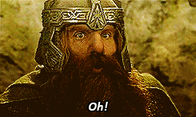

# L'attaque de Minastitrique

Il y a **trés longtemps** dans une contrée trés lointaine,  
Un armée de nain se battait arme à la main,  
Soudainement, une envie pressante les arrêta... 

Pendant ce temps..

> Seigneur, nous avons un problème!

> Quel est-il Laiglolas ?

> Je suis stuck gold IV.

> Est-ce vous le grand Golderack, Seigneur des contrées lointaines du fort de Fort Fort Lointan ?

C'est alors qu'une nymphe venant des eaux arides de Garstrèsdur sortit de l'eau criant :

>j'ai vue ton avenir Spok, tu te marrira avec le grand et l'unique Darkvador

le probleme c'est que l'interlocuteur de la nymphe n'est pas Spok mais le seul est unique E.T

> excusez moi madame la nymphe mais je me nome E.T pas Spok mais votre profesi est pour moi ou pas du coup ?
